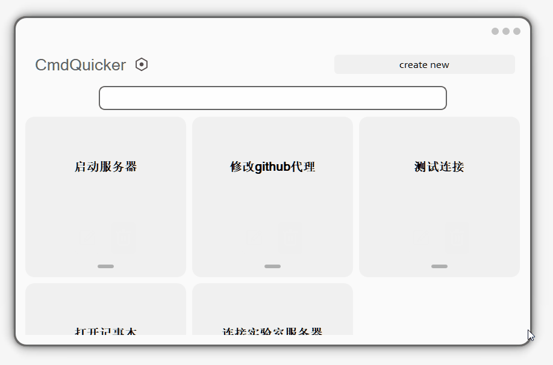
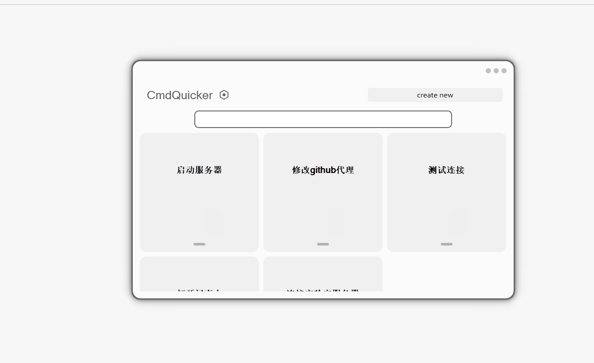

# CMDQuicker

> 偶然看到一个项目，用Qt做出的界面还能这么好看，想着自己之前做的Qt界面都巨丑，弄一个玩一下，外观参考[Linloir/GraphBuilder: A visualized tool to create a graph (github.com)](https://github.com/Linloir/GraphBuilder)

编译完后的链接: [下载地址](https://github.com/799034552/CMDQuicker/files/9702285/CMDQuick.zip)

## 外观

* 无边框的界面
* 转动的icon
* 有遮罩的滑动界面
* 有动画的输入栏
* 有大量动画的条目框，淡入淡出
* 有平滑动画的滚动窗口

## 功能

就是简单的输入cmd命令，能够实现可视和不可视两种

## 开发坑

开发时间很短（~~导师给的任务要到ddl~~），但是中途还是踩了一些坑

* setMouseTracking需要父组件也设置
* qml嵌入Widget中不能使用anminate动画，搞的我还专门学了一下QML
*  静态资源.qrc文件有名字不能使用“qrc:/xxx”文件名，要用":/xxx"
* 使用QQuickWidget无法正常显示图片，这个没有找到原因，可能是嵌入Widget的问题，没有Widget当父组件是可以的
*  在顶层widget使用Q_OBject可能会覆盖样式，要加上setAttribute(Qt::WA_StyledBackground)
*  不完全支持css，padding需要明确指定padding-left，border-radius不能指定四个角
* cmd的输出中文要utf-16，而不是utf8

> 用传统的QWidget搞好看的动画界面真实太麻烦了，又要用css样式，但是又不完全支持，这个界面用前端写的话几个小时就搞定了，以后真的要转qml了（什么年代，还在用传统qt）

由于懒惰，项目中有一些没用到的静态资源没有删除
# TODO
- [ ] 适配ubuntu